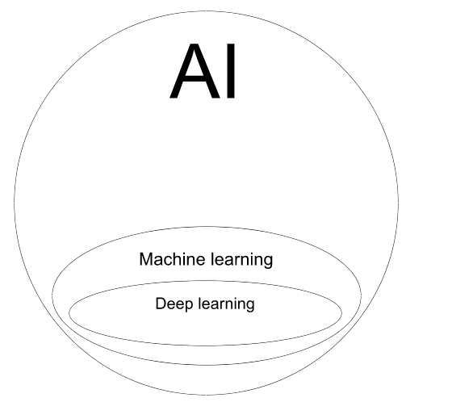
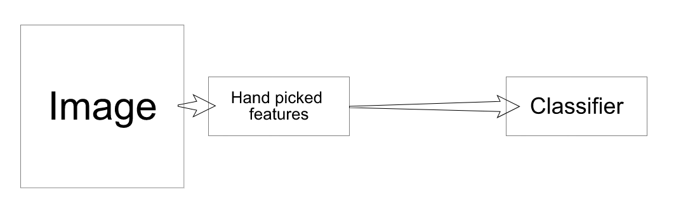
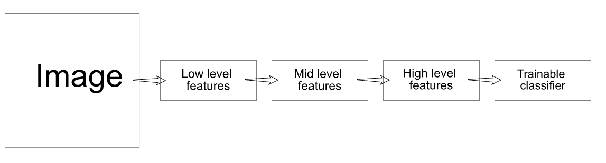
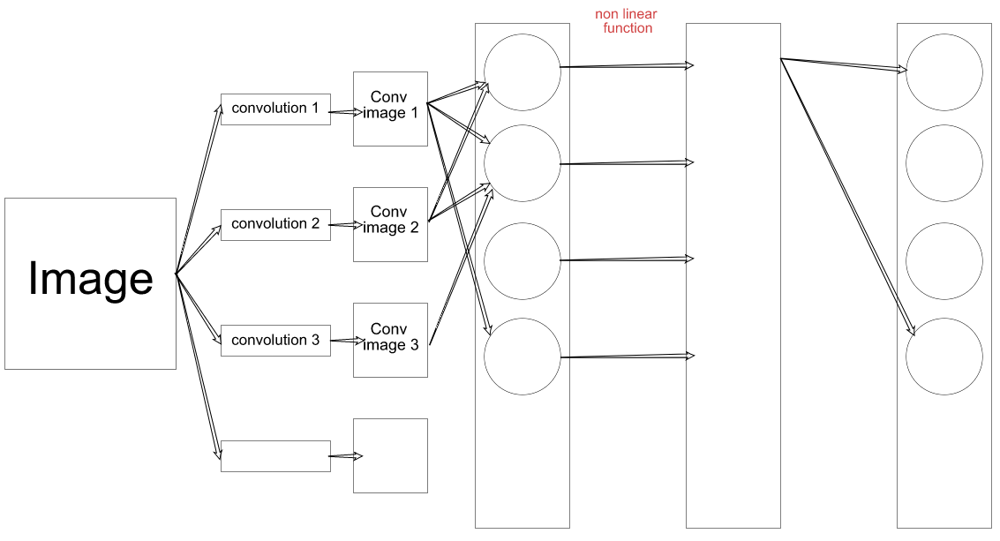

# AI, Machine Learning, Deep Learning

How are thoses three things related? An image explains better than words:

The field of Deep learning is included in the field of Machine learning, which is itself included in the field of Artificial Intelligence.

## The first machine that learned

The first machine invented that learned was made in 1957 and was called the Perceptron. A very simple simulated neuron with adaptive "synaptic neurons" which adapted with training.

When we talk about Machine Learning we mainly talk about supervised learning models. Just like the Support Vector Machine (*SVM*) whose concept is as followed:

> Input data is given a set class by the superviser (human)

> Whenever another input data is given, the SVM approximates its class depending on his training

> SVM cannot estimate a class it doesn't know

This model has been used for over 50 years and is still used nowadays.

## Machine learning / Deep learning
*If we take the exemple of image processing:*

With a Machine learning approche:

With a Deep learning approche:

We can make a parralel of this with Deep learning in text analysis:

Text --> Caracters --> Words --> Word Group --> Clause --> Sentense --> Story --> Classifier

But how does it translate with a trainable AI?

**Multi-Layer Neural Network.**

As you can see in the image above, we use the image with different convolution masks on the image to extract some features from the image. These images are used by combination in a first neural layer which trains its "synaps" with a non linear function to interact with lower level layers.

One of the most used Multilayer Neural Network is the one invented by Yan LECUN (and associates) in 1989 called LeNet. LeNet is what we now call a **ConvNet** *or* Convolution Neural Network (**CNN**).

This model is now used everywhere. Image processing, text processing. Supervised models, unsupervised models.

In its early stages, AI could define the object of the image it was shown, then it could seperate different objects inside an image. In 2015 we could create an AI that described what it was seeing. However this was on static images. We are now capable of convolution on video, enabling an AI to understand what is happening in a video.

We also have seen appear the notion of Deep Masking (very thin masking of objects to see multiple elements clumped up) and Inverted Convolution Networks (giving masks to AI so he can tell what it represents).

Natural Language Processing (NLP) is also a very active subject in the area of research in machine learning and deep learning.

2011 - Word2Vec --> Predicts words from previous or next words.

2014 - Automated deep translator --> More performant than current translators but more expensive to run.

## 4 missing pieces for AI

>	Theoretical Understand of DL

> Integrating DL with planning, attention, memory

> Integrating supervised, unsupervised & reinforced models in one single algorithm

> Effective ways to do unsupervised AI
