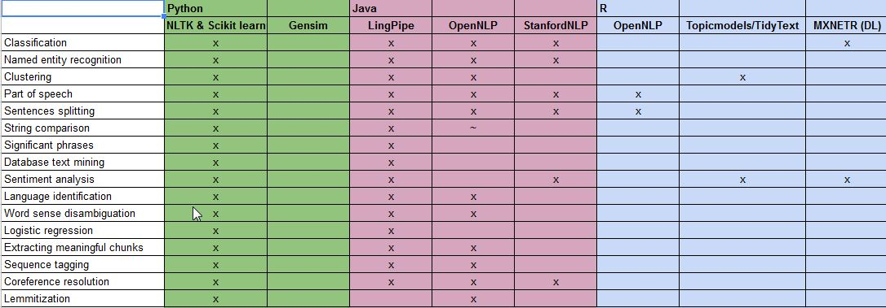

**NLP State of Art** was conducted following both theorical and practical approaches

Findings were dispatch on 4 main categories
* Deep and Machine Learnings
* Semantic and Sentiment Analysis
* Text Mining
* Topic Analysis

In each category folder, you'll find a set of documents that explains main concepts and most known frameworks.

From an experimentation standpoint, we looked into various frameworks, each of which belongs to a given language (Java, Pyhon, R). Below, a summary of the capabilities of each framwork:

  

 
**Pyhon:**
* NLTK  : Suite of libraries and programs for symbolic and statistical natural language processing for the English language; written in Python programming language.
* Scikit Learn :  Machine learning library that features various classification, regression and clustering algorithms.
* Gensin : Library for topic modelling, document indexing and similarity retrieval with large corpora. Target audience is the NLP and Information Retrival (IR) community.

**Java:**
* LingPipe : Toolkit for processing text using computational linguistics
* OpenNLP :  Machine learning based toolkit for the processing of natural language text
* StanfordNLP : Set of NLP tools. From text input, gives the base forms of words, their parts of speech and whether they are names of companies, people, etc

**R:**
* OpenNLP : Wrapper of OpenNLP in R
* TopicModels/TidyText : Interface to the C code for Latent Dirichlet Allocation (LDA) models and Correlated Topics Models (CTM)
* MXNETR : Open-source deep learning framework used to train and deploy deep neural networks
 
 
